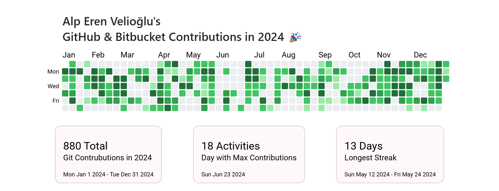

<!-- <a id="readme-top"></a>

[![Contributors][contributors-shield]][contributors-url]
[![Forks][forks-shield]][forks-url]
[![Stargazers][stars-shield]][stars-url]
[![Issues][issues-shield]][issues-url]
[![MIT License][license-shield]][license-url]
[![LinkedIn][linkedin-shield]][linkedin-url]

<br /> -->
<a id="readme-top"></a>
<div align="center">
  <a href="https://github.com/alpvelioglu/git-contribution-calendar-ext">
    
  </a>

<h3 align="center">Git Contribution Calendar</h3>

  <p align="center">
    A modern web application that visualizes your git contributions across multiple providers (GitHub, Bitbucket) in a unified calendar view.
    <br />
    <br />
    <a href="https://github.com/alpvelioglu/git-contribution-calendar-ext">View Demo</a>
    ·
    <a href="https://github.com/alpvelioglu/git-contribution-calendar-ext/issues">Report Bug</a>
    ·
    <a href="https://github.com/alpvelioglu/git-contribution-calendar-ext/issues">Request Feature</a>
  </p>
</div>

## About The Project



Git Contribution Calendar is a powerful tool that aggregates and visualizes your git contributions from multiple providers. Whether you're using GitHub, Bitbucket, or both, this application provides a unified view of your coding activity throughout the year.

**Note:**
* If you need VPN connection to access Bitbucket, you have to use <a href="https://github.com/alpvelioglu/git-contribution-calendar-ext">git-contribution-calendar-ext</a>
  - It uses browser cookies to authenticate and access Bitbucket so you don't need to use Bitbucket access token if you login with Bitbucket account in the browser before using the extension.
* If you don't need VPN connection, you can use <a href="https://github.com/alpvelioglu/git-contribution-calendar-angular">git-contribution-calendar-angular</a>
  - It uses .NET Minimal API to access Bitbucket. See more details in the <a href="https://github.com/alpvelioglu/GitContributionCalendar.MinimalAPI">GitContributionCalendar.MinimalAPI</a> repository.


Key Features:
* Multi-provider support (GitHub and Bitbucket integration)
* Interactive contribution heatmap using D3.js
* Contribution statistics and insights
* Multi-language support (English & Turkish)
* Share capabilities

### Built With

* [![Angular][Angular.io]][Angular-url]
* [![TypeScript][TypeScript]][TypeScript-url]
* [![TailwindCSS][TailwindCSS]][Tailwind-url]
* [![D3.js][D3.js]][D3-url]
* [![Material][Material]][Material-url]
* [![Apollo][Apollo]][Apollo-url]

## Getting Started

To get a local copy up and running, follow these steps:

### Prerequisites

* Node.js (v18 or higher)
* npm
  ```sh
  npm install npm@latest -g
  ```
* Angular CLI
  ```sh
  npm install -g @angular/cli
  ```

### Installation
   
1. Clone the repo
   ```sh
   git clone https://github.com/alpvelioglu/git-contribution-calendar-ext.git
   ```
2. Install NPM packages for both folders
   ```sh
   cd git-contribution-calendar-ext/angular
   npm install
   cd ..
   cd git-contribution-calendar-ext/chrome
   npm install
   ```

## Usage

1. Start the development server:
   ```sh
   cd git-contribution-calendar-ext
   npm run start
   ```
2. It will create new folder under angular called `dist`
3. Open your chromium based browser and on the extension page, click on "Load unpacked" button and select the `dist` folder (You need developer mode enabled in the browser).
4. Click on extension icon and enjoy!


## Roadmap

- [x] GitHub Integration
- [x] Bitbucket Integration
- [x] Multi-language Support
- [ ] GitLab Integration
- [ ] Custom Date Range Selection
- [ ] Dark Theme
- [ ] Fixing color schema with dynamic colors

See the [open issues](https://github.com/alpvelioglu/git-contribution-calendar-ext/issues) for a full list of proposed features and known issues.

## Contributing

Contributions are welcome! Any contributions you make are **greatly appreciated**.

1. Fork the Project
2. Create your Feature Branch (`git checkout -b feature/AmazingFeature`)
3. Commit your Changes (`git commit -m 'Add some AmazingFeature'`)
4. Push to the Branch (`git push origin feature/AmazingFeature`)
5. Open a Pull Request

## License

Distributed under the MIT License. See `LICENSE.txt` for more information.

## Contact

aeren53.ae@gmail.com

Project Link: [https://github.com/alpvelioglu/git-contribution-calendar-ext](https://github.com/alpvelioglu/git-contribution-calendar-ext)

## Acknowledgments

* [Angular Material](https://material.angular.io/)
* [D3.js](https://d3js.org/)
* [Apollo GraphQL](https://www.apollographql.com/)
* [Tailwind CSS](https://tailwindcss.com/)

<p align="right">(<a href="#readme-top">back to top</a>)</p>

<!-- MARKDOWN LINKS & IMAGES -->
[contributors-shield]: https://img.shields.io/github/contributors/alpvelioglu/git-contribution-calendar-ext.svg?style=for-the-badge
[contributors-url]: https://github.com/alpvelioglu/git-contribution-calendar-ext/graphs/contributors
[forks-shield]: https://img.shields.io/github/forks/alpvelioglu/git-contribution-calendar-ext.svg?style=for-the-badge
[forks-url]: https://github.com/alpvelioglu/git-contribution-calendar-ext/network/members
[stars-shield]: https://img.shields.io/github/stars/alpvelioglu/git-contribution-calendar-ext.svg?style=for-the-badge
[stars-url]: https://github.com/alpvelioglu/git-contribution-calendar-ext/stargazers
[issues-shield]: https://img.shields.io/github/issues/alpvelioglu/git-contribution-calendar-ext.svg?style=for-the-badge
[issues-url]: https://github.com/alpvelioglu/git-contribution-calendar-ext/issues
[license-shield]: https://img.shields.io/github/license/alpvelioglu/git-contribution-calendar-ext.svg?style=for-the-badge
[license-url]: https://github.com/alpvelioglu/git-contribution-calendar-ext/blob/master/LICENSE.txt
[linkedin-shield]: https://img.shields.io/badge/-LinkedIn-black.svg?style=for-the-badge&logo=linkedin&colorB=555
[linkedin-url]: https://linkedin.com/in/your_linkedin_username
[product-screenshot]: public/assets/screenshot.png
[Angular.io]: https://img.shields.io/badge/Angular-DD0031?style=for-the-badge&logo=angular&logoColor=white
[Angular-url]: https://angular.io/
[TypeScript]: https://img.shields.io/badge/TypeScript-007ACC?style=for-the-badge&logo=typescript&logoColor=white
[TypeScript-url]: https://www.typescriptlang.org/
[TailwindCSS]: https://img.shields.io/badge/Tailwind_CSS-38B2AC?style=for-the-badge&logo=tailwind-css&logoColor=white
[Tailwind-url]: https://tailwindcss.com/
[D3.js]: https://img.shields.io/badge/D3.js-F9A03C?style=for-the-badge&logo=d3.js&logoColor=white
[D3-url]: https://d3js.org/
[Material]: https://img.shields.io/badge/Material-757575?style=for-the-badge&logo=material-design&logoColor=white
[Material-url]: https://material.angular.io/
[Apollo]: https://img.shields.io/badge/Apollo%20GraphQL-311C87?style=for-the-badge&logo=apollo-graphql&logoColor=white
[Apollo-url]: https://www.apollographql.com/